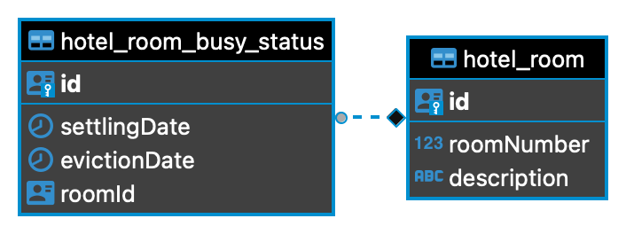

## Description

[Hotels](https://github.com/IvanMMM/test-task-hotel-wizards) test-task repository.

## Installation

```bash
$ npm install
```

## Environment


## Documentation

Swagger documentation is located at `/doc` route

## Database Schema



## Running the app

```bash
# development
$ npm run start

# watch mode
$ npm run start:dev

# production mode
$ npm run start:prod
```

## Test

```bash
# integration testing
$ npm run test
```